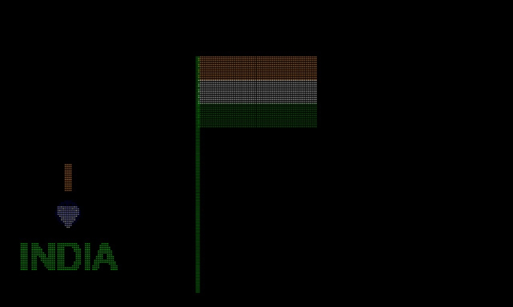

# tirangaV2

<h1 align="center"> TriColour (The Indian Flag)</h1>

 

 

## About My Project

I made this  amazing animated "TriColour" with the help of venilla javascript and Canvas ..

This project is a random thought. It has a simple plane ui that shows the Indian National flag through a random particle animation. It has many features that shows the diffraction between the particles. 
The greater time you hold the screen the greater randomness will shallow. It has a beautiful colour combinations having some written texts. 
The Chakra of the flag also blink regularly and this gives a soothing experience. 

Let's run this code on your pc or smart phone...

I know this gonna blow your mind 😉...

### Let's contribute to my project

And most important thing if you think you can modify this amazing flag..Sure you can go for this.. You will enjoy a lot in doing so... 🥰

First you have to create an issue reading what you want to change in my project and then fork my project ... 

Don't forget to star ✨ mark the repo 🤩

    #All the best guys..👍
